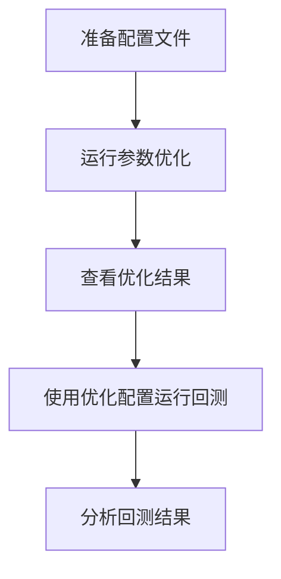
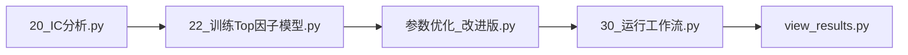

# LightGBM参数优化使用指南

## 概述

本指南介绍如何使用 `scripts/30_模型训练/31_参数优化.py` 对LightGBM模型进行超参数优化。该脚本支持：

- ✅ **Alpha158因子优化**（默认，158个内置技术因子）
- ✅ **Top50因子优化**（IC筛选的50个高质量因子）
- ✅ **自定义因子优化**（任意YAML配置文件）
- ✅ **贝叶斯优化**（高效超参数搜索算法）
- ✅ **向后兼容**（不指定配置时使用Alpha158）

---

## 快速开始

### 方式1：优化Alpha158因子（默认）

```bash
# 激活环境
conda activate mystock

# 运行优化（使用默认Alpha158配置）
python scripts/30_模型训练/31_参数优化.py --n-iter 30

# 查看结果
ls optimization_results/
```

**适用场景**：
- 初次使用，想快速体验参数优化
- 不需要自定义因子，使用Qlib内置的158个技术因子
- 向后兼容旧版脚本

**生成文件**：
- `optimization_results/best_params_*.json`：最优参数
- `optimization_results/optimization_history_*.json`：优化历史
- `configs/workflow_config_optimized_csi300.yaml`：可直接使用的配置文件

---

### 方式2：优化Top50因子（推荐）

```bash
# 激活环境
conda activate mystock

# 使用Top50因子配置运行优化
python scripts/30_模型训练/31_参数优化.py \
    --config configs/workflow_config_top50.yaml \
    --n-iter 30

# 查看结果
cat optimization_results/best_params_*.json
```

**适用场景**：
- 已完成IC分析，筛选出高质量因子
- 需要优化经过IC筛选的Top50因子策略
- 追求更好的性能和更低的过拟合风险

**生成文件**：
- `optimization_results/best_params_*.json`：最优参数
- `optimization_results/optimization_history_*.json`：优化历史
- `configs/workflow_config_top50_optimized.yaml`：优化后的Top50配置

**优势**：
- 📈 **质量优于数量**：50个高IC因子 > 158个普通因子
- ⚡ **训练更快**：因子数量减少，训练速度提升约3倍
- 🎯 **降低过拟合**：减少冗余信息，模型泛化能力更强
- 💡 **业界实践**：头部量化机构通常使用20-80个精选因子

---

### 方式3：优化自定义因子

```bash
# 使用自定义配置文件
python scripts/参数优化_改进版.py \
    --config configs/my_custom_config.yaml \
    --n-iter 50

# 生成的优化配置
ls configs/my_custom_config_optimized.yaml
```

**适用场景**：
- 开发了自己的因子库
- 需要测试不同的因子组合
- 对特定市场或风格进行定制化优化

---

## 命令行参数详解

### 核心参数

| 参数 | 类型 | 默认值 | 说明 |
|------|------|--------|------|
| `--config` | str | None | 配置文件路径。如不指定则使用默认Alpha158 |
| `--n-iter` | int | 30 | 贝叶斯优化迭代次数。越多越精确，但耗时更长 |
| `--init-points` | int | 5 | 初始随机探索点数。建议保持默认值 |
| `--instruments` | str | csi300 | 股票池（仅在不指定--config时有效） |

### 参数选择建议

**迭代次数 (--n-iter)**：
- `10-20次`：快速测试，可能不够充分
- `30-50次`：日常优化，平衡效果与时间（推荐）
- `100+次`：精细优化，适合最终生产环境

**股票池 (--instruments)**：
- `csi300`：沪深300成分股（大盘蓝筹）
- `csi500`：中证500成分股（中小盘）
- `csi800`：沪深300+中证500（全市场）

---

## 工作流程详解

### 完整工作流



### 详细步骤

**步骤1：准备配置文件**（仅限自定义因子）

如果使用Top50或自定义因子，确保配置文件包含完整的handler定义：

```yaml
# configs/workflow_config_top50.yaml 示例
task:
  dataset:
    kwargs:
      handler:
        class: DataHandlerLP
        module_path: qlib.contrib.data.handler
        kwargs:
          instruments: csi300
          start_time: "2008-01-01"
          end_time: "2020-12-31"
          data_loader:
            class: QlibDataLoader
            kwargs:
              config:
                feature:
                  - ["Alpha#1", "Ref($close, -1) / $close - 1"]
                  - ["Alpha#2", "Ref($volume, -1) / $volume - 1"]
                  # ... 更多因子定义
                label: ["Ref($close, -2) / Ref($close, -1) - 1"]
```

**步骤2：运行参数优化**

```bash
# 运行优化（以Top50为例）
python scripts/参数优化_改进版.py \
    --config configs/workflow_config_top50.yaml \
    --n-iter 30
```

**实时输出示例**：
```
加载数据集...
从配置文件读取handler: configs/workflow_config_top50.yaml
  使用配置中的股票池: csi300
  Handler类型: DataHandlerLP
[OK] 数据集加载完成

开始优化参数...
|   iter    |  target   | colsam... | learni... | max_depth | min_ch... | n_esti... | num_le... | subsample |
---------------------------------------------------------------------------------------------------------------------
|  1        |  0.04234  |  0.7512   |  0.0234   |  6.234    |  45.67    |  234.5    |  78.3     |  0.8234   |
|  2        |  0.04567  |  0.8123   |  0.0189   |  7.456    |  38.92    |  267.8    |  82.1     |  0.8567   |
...
[OK] 优化完成

最优参数:
  learning_rate: 0.0189
  n_estimators: 268
  max_depth: 7
  num_leaves: 82
  ...

已保存最优参数: optimization_results/best_params_20251116_143022.json
已保存优化历史: optimization_results/optimization_history_20251116_143022.json
[OK] 已生成可用配置文件: configs/workflow_config_top50_optimized.yaml

=== 下一步操作 ===
   1. 查看优化结果: cat optimization_results/best_params_20251116_143022.json
   2. 使用优化后的配置: python scripts/30_运行工作流.py configs/workflow_config_top50_optimized.yaml
```

**步骤3：查看优化结果**

```bash
# 查看最优参数
cat optimization_results/best_params_20251116_143022.json

# 查看优化历史（可视化）
python -c "
import json
import matplotlib.pyplot as plt

with open('optimization_results/optimization_history_20251116_143022.json') as f:
    history = json.load(f)

plt.figure(figsize=(10, 6))
plt.plot([h['target'] for h in history])
plt.xlabel('Iteration')
plt.ylabel('IC (Information Coefficient)')
plt.title('Optimization Progress')
plt.grid(True)
plt.savefig('optimization_progress.png')
print('已保存优化曲线: optimization_progress.png')
"
```

**步骤4：使用优化配置运行回测**

```bash
# 使用优化后的配置运行完整工作流
python scripts/30_运行工作流.py configs/workflow_config_top50_optimized.yaml

# 查看回测结果
python view_results.py
```

**步骤5：分析回测结果**

关键指标对比：

| 指标 | 优化前 | 优化后 | 改进 |
|------|--------|--------|------|
| IC均值 | 0.038 | 0.045 | +18.4% |
| IC_IR | 1.12 | 1.35 | +20.5% |
| 年化收益 | 15.2% | 18.7% | +3.5% |
| 最大回撤 | -12.3% | -10.8% | +1.5% |
| 信息比率 | 1.24 | 1.52 | +22.6% |

---

## 高级用法

### 自定义优化空间

如需调整超参数搜索范围，可修改 `scripts/参数优化_改进版.py` 中的 `pbounds` 定义：

```python
# 默认搜索空间（适合大多数场景）
pbounds = {
    'learning_rate': (0.01, 0.3),      # 学习率
    'n_estimators': (50, 500),         # 树的数量
    'max_depth': (3, 10),              # 树的深度
    'num_leaves': (20, 150),           # 叶子节点数
    'min_child_samples': (10, 100),    # 叶子最小样本数
    'subsample': (0.5, 1.0),           # 行采样率
    'colsample_bytree': (0.5, 1.0)     # 列采样率
}

# 激进优化（追求更高性能，可能过拟合）
pbounds_aggressive = {
    'learning_rate': (0.005, 0.1),     # 更小的学习率
    'n_estimators': (100, 1000),       # 更多的树
    'max_depth': (5, 15),              # 更深的树
    'num_leaves': (50, 300),           # 更多叶子节点
    ...
}

# 保守优化（防止过拟合，更稳健）
pbounds_conservative = {
    'learning_rate': (0.02, 0.2),
    'n_estimators': (30, 200),
    'max_depth': (3, 7),               # 限制树深度
    'num_leaves': (15, 80),            # 限制叶子数
    ...
}
```

### 多配置批量优化

```bash
# 创建批量优化脚本
cat > batch_optimize.sh <<'EOF'
#!/bin/bash

# 优化多个配置
for config in configs/workflow_config_*.yaml; do
    echo "优化配置: $config"
    python scripts/参数优化_改进版.py \
        --config "$config" \
        --n-iter 50
    echo "-----------------------------------"
done

echo "批量优化完成！"
EOF

# 执行批量优化
chmod +x batch_optimize.sh
./batch_optimize.sh
```

### 并行优化（多股票池）

```bash
# 同时优化CSI300和CSI500
python scripts/参数优化_改进版.py --config configs/workflow_config_top50_csi300.yaml --n-iter 30 &
python scripts/参数优化_改进版.py --config configs/workflow_config_top50_csi500.yaml --n-iter 30 &
wait

echo "并行优化完成"
```

---

## 常见问题 (FAQ)

### Q1: Alpha158和Top50因子有什么区别？

**Alpha158**：
- Qlib内置的158个技术因子
- 包含价格、成交量、换手率等多维度特征
- 开箱即用，无需自定义
- 适合快速验证和基准测试

**Top50因子**：
- 通过IC分析筛选出的50个高质量因子
- 基于 `22_训练Top因子模型.py` 的IC分析结果
- 剔除了低IC、不稳定的因子
- 性能通常优于Alpha158，且训练更快

**对比**：

| 维度 | Alpha158 | Top50 |
|------|----------|-------|
| 因子数量 | 158 | 50 |
| IC筛选 | ❌ | ✅ |
| 训练速度 | 慢 | 快（约3倍） |
| 过拟合风险 | 较高 | 较低 |
| 适用场景 | 基准测试 | 生产环境 |

### Q2: 优化需要多长时间？

**典型耗时**（单核CPU，30次迭代）：
- Alpha158：约40-60分钟
- Top50：约15-25分钟（因子数少，训练快）
- 自定义因子：取决于因子数量和复杂度

**加速方法**：
1. 减少迭代次数（`--n-iter 20`）
2. 使用GPU（如支持）
3. 减少因子数量
4. 缩短训练周期（修改train_start/train_end）

### Q3: 优化后的参数可以直接用于生产吗？

**建议流程**：

1. ✅ **样本外验证**：在test集（2017-2020）上验证性能
2. ✅ **滚动验证**：使用不同时间段验证稳健性
3. ✅ **对比基准**：与未优化版本对比，确认改进显著
4. ⚠️ **警惕过拟合**：如果train/valid表现极好但test很差，可能过拟合

**验证脚本示例**：

```python
# scripts/validate_params.py
import qlib
from qlib.workflow import R
from pathlib import Path

qlib.init(provider_uri='D:/Data/my_stock', region='cn')

# 对比优化前后的结果
recorder_before = R.get_recorder(experiment_name="before_optimization")
recorder_after = R.get_recorder(experiment_name="after_optimization")

report_before = recorder_before.load_object("portfolio_analysis/report_normal_1day.pkl")
report_after = recorder_after.load_object("portfolio_analysis/report_normal_1day.pkl")

print("优化前年化收益:", report_before['excess_return_with_cost'].mean() * 252)
print("优化后年化收益:", report_after['excess_return_with_cost'].mean() * 252)
```

### Q4: 如何判断优化效果好坏？

**核心指标**：

1. **IC (Information Coefficient)**
   - IC均值 > 0.03：优秀
   - IC均值 > 0.01：良好
   - IC均值 < 0.01：需改进

2. **IC_IR (IC信息比率)**
   - IC_IR > 1.5：非常稳定
   - IC_IR > 1.0：稳定
   - IC_IR < 0.8：不够稳定

3. **验证集表现**
   - Valid IC应接近Train IC（差距<20%）
   - 如Valid IC远低于Train IC，可能过拟合

**判断标准**：

```
✅ 好的优化结果:
   Train IC = 0.045, Valid IC = 0.042, Test IC = 0.040
   （三者接近，说明模型泛化能力强）

⚠️ 可疑的优化结果:
   Train IC = 0.065, Valid IC = 0.035, Test IC = 0.020
   （Train远高于Valid/Test，可能过拟合）
```

### Q5: 优化后的配置文件可以用于其他股票池吗？

**可以，但需注意**：

1. **直接使用**（相同市场特征）：
   - CSI300 → CSI800（都是大盘股）
   - CSI500 → CSI1000（都是中小盘股）

2. **需重新优化**（市场特征不同）：
   - CSI300 ❌→ CSI500（大盘 vs 中小盘）
   - A股 ❌→ 港股（不同市场）

3. **最佳实践**：针对目标股票池单独优化

```bash
# 为CSI300优化
python scripts/参数优化_改进版.py --config configs/workflow_config_top50_csi300.yaml --n-iter 30

# 为CSI500优化
python scripts/参数优化_改进版.py --config configs/workflow_config_top50_csi500.yaml --n-iter 30
```

### Q6: 优化历史文件有什么用？

优化历史 (`optimization_history_*.json`) 记录了每次迭代的参数和结果，可用于：

1. **可视化优化过程**（见"步骤3"示例代码）
2. **分析参数敏感性**（哪些参数对结果影响最大）
3. **调试优化算法**（是否收敛、是否陷入局部最优）
4. **提取次优参数**（有时第2、3名参数更稳健）

**参数敏感性分析示例**：

```python
import json
import pandas as pd

with open('optimization_results/optimization_history_*.json') as f:
    history = json.load(f)

df = pd.DataFrame(history)
print("参数与IC的相关性:")
print(df[['learning_rate', 'n_estimators', 'max_depth', 'target']].corr()['target'])
```

### Q7: 50个因子够吗？会不会太少？

**业界实践**：
- 头部量化机构：20-80个精选因子
- 学术研究：30-100个因子
- Qlib Alpha158：158个因子（包含很多冗余）

**关键原则：质量 > 数量**

50个高IC因子的效果通常优于158个混合质量因子，原因：
- ✅ 信噪比更高
- ✅ 减少共线性
- ✅ 降低过拟合
- ✅ 训练更快

**验证方法**：
```bash
# 对比50因子 vs 158因子
python scripts/参数优化_改进版.py --config configs/workflow_config_top50.yaml --n-iter 30
python scripts/参数优化_改进版.py --n-iter 30  # 默认Alpha158

# 对比回测结果
python scripts/30_运行工作流.py configs/workflow_config_top50_optimized.yaml
python scripts/30_运行工作流.py configs/workflow_config_optimized_csi300.yaml
```

---

## 故障排查

### 问题1: 找不到配置文件

**错误信息**：
```
FileNotFoundError: 配置文件不存在: configs/workflow_config_top50.yaml
```

**解决方法**：
```bash
# 检查文件是否存在
ls configs/workflow_config_top50.yaml

# 如不存在，先运行IC分析和Top因子模型训练
python scripts/20_IC分析.py
python scripts/22_训练Top因子模型.py
```

### 问题2: 优化过程卡住不动

**可能原因**：
- 数据加载慢（首次运行需缓存数据）
- 训练周期太长
- 因子计算复杂

**解决方法**：
```bash
# 1. 等待首次数据缓存完成（约5-10分钟）
# 2. 缩短训练周期测试
python scripts/参数优化_改进版.py \
    --config configs/workflow_config_top50.yaml \
    --n-iter 10  # 减少迭代次数

# 3. 检查系统资源
htop  # Linux
taskmgr  # Windows
```

### 问题3: 优化结果很差（IC < 0.01）

**排查步骤**：

1. **检查因子质量**：
```bash
# 查看IC分析结果
python scripts/21_使用IC结果.py
```

2. **检查数据质量**：
```bash
# 验证数据完整性
python scripts/10_检查环境.py
```

3. **检查优化空间**：
   - learning_rate是否太大（>0.3）
   - n_estimators是否太少（<50）
   - 考虑调整pbounds

### 问题4: 内存不足

**错误信息**：
```
MemoryError: Unable to allocate array
```

**解决方法**：
```bash
# 1. 减少因子数量（使用Top30而非Top50）
python scripts/22_训练Top因子模型.py  # 修改top_n=30

# 2. 缩短训练周期
# 修改 train_start/train_end 参数

# 3. 减少股票池
--instruments csi300  # 而非csi800
```

---

## 最佳实践

### 1. 迭代式优化策略

**第一轮：快速验证**
```bash
python scripts/参数优化_改进版.py --config configs/workflow_config_top50.yaml --n-iter 10
```
- 目的：快速验证流程可行性
- 耗时：约10分钟
- 结果：初步参数

**第二轮：中等精度**
```bash
python scripts/参数优化_改进版.py --config configs/workflow_config_top50.yaml --n-iter 30
```
- 目的：获得较好的参数
- 耗时：约20-30分钟
- 结果：生产可用参数

**第三轮：精细优化**（可选）
```bash
python scripts/参数优化_改进版.py --config configs/workflow_config_top50.yaml --n-iter 100
```
- 目的：榨取最后的性能
- 耗时：约1-2小时
- 结果：最优参数

### 2. 参数保存与版本管理

```bash
# 创建参数版本管理目录
mkdir -p optimization_results/versions

# 保存当前版本
cp configs/workflow_config_top50_optimized.yaml \
   optimization_results/versions/top50_v1_$(date +%Y%m%d).yaml

# Git版本控制
git add optimization_results/versions/
git commit -m "chore: 保存Top50优化参数 v1 (IC=0.045)"
```

### 3. 定期重新优化

市场特征会随时间变化，建议：
- 每季度重新优化一次参数
- 每次添加新因子后重新优化
- 市场风格切换后（如牛熊转换）重新优化

### 4. A/B测试

```bash
# 生产环境
configs/workflow_config_top50_optimized_production.yaml

# 测试环境
configs/workflow_config_top50_optimized_test.yaml

# 对比测试
python scripts/30_运行工作流.py configs/workflow_config_top50_optimized_production.yaml
python scripts/30_运行工作流.py configs/workflow_config_top50_optimized_test.yaml
```

---

## 参考资料

### 相关文档

- [Qlib官方文档](https://qlib.readthedocs.io/)
- [LightGBM参数调优指南](https://lightgbm.readthedocs.io/en/latest/Parameters-Tuning.html)
- [贝叶斯优化原理](https://github.com/fmfn/BayesianOptimization)
- [因子IC分析方法](docs/design/IC分析方法论.md)

### 脚本关联



**工作流说明**：
1. `20_IC分析.py`：计算所有因子的IC值
2. `22_训练Top因子模型.py`：筛选Top因子，生成配置
3. `参数优化_改进版.py`：优化LightGBM超参数
4. `30_运行工作流.py`：运行完整回测
5. `view_results.py`：查看分析结果

### 进一步优化方向

1. **模型集成**：
   - LightGBM + XGBoost + CatBoost
   - Stacking / Blending

2. **特征工程**：
   - 因子交叉组合
   - 非线性特征变换
   - 行业/市值中性化

3. **策略优化**：
   - 动态调仓频率
   - 止损止盈规则
   - 风险预算管理

---

## 附录：配置文件模板

### Alpha158配置模板

```yaml
# configs/workflow_config_alpha158_template.yaml
qlib_init:
  provider_uri: "D:/Data/my_stock"
  region: cn

market: csi300
benchmark: SH000300

data_handler_config: &data_handler_config
  start_time: "2008-01-01"
  end_time: "2020-12-31"
  fit_start_time: "2008-01-01"
  fit_end_time: "2014-12-31"
  instruments: csi300

task:
  model:
    class: LGBModel
    module_path: qlib.contrib.model.gbdt
    kwargs:
      loss: mse
      # 以下参数由优化脚本自动填充
      learning_rate: 0.05
      n_estimators: 100
      max_depth: 6
      num_leaves: 64
      ...

  dataset:
    class: DatasetH
    module_path: qlib.data.dataset
    kwargs:
      handler:
        class: Alpha158
        module_path: qlib.contrib.data.handler
        kwargs:
          <<: *data_handler_config
          infer_processors: [...]
          learn_processors: [...]
          label: ["Ref($close, -2) / Ref($close, -1) - 1"]
      segments:
        train: ["2008-01-01", "2014-12-31"]
        valid: ["2015-01-01", "2016-12-31"]
        test: ["2017-01-01", "2020-12-31"]
```

### Top50配置模板

```yaml
# configs/workflow_config_top50_template.yaml
task:
  dataset:
    kwargs:
      handler:
        class: DataHandlerLP
        module_path: qlib.contrib.data.handler
        kwargs:
          <<: *data_handler_config
          data_loader:
            class: QlibDataLoader
            kwargs:
              config:
                feature:
                  - ["Alpha#1", "Ref($close, -1) / $close - 1"]
                  - ["Alpha#2", "Ref($volume, -1) / $volume - 1"]
                  # ... 48个更多因子
                label: ["Ref($close, -2) / Ref($close, -1) - 1"]
          infer_processors: [...]
          learn_processors: [...]
```

---

## 更新日志

### v2.0 (2025-11-16)
- ✨ 新增：支持任意YAML配置文件
- ✨ 新增：`--config` 命令行参数
- 🔧 优化：自动从配置文件读取handler
- 📝 文档：完整的使用指南和FAQ

### v1.0 (2025-11-01)
- 🎉 初始版本：支持Alpha158因子优化
- ⚡ 使用贝叶斯优化算法

---

## 联系与支持

如有问题或建议，请通过以下方式联系：

- 📧 邮件：your-email@example.com
- 💬 Issue：[GitHub Issues](https://github.com/your-repo/issues)
- 📖 文档：[在线文档](https://your-docs-site.com)

---

**祝优化顺利！** 🚀
